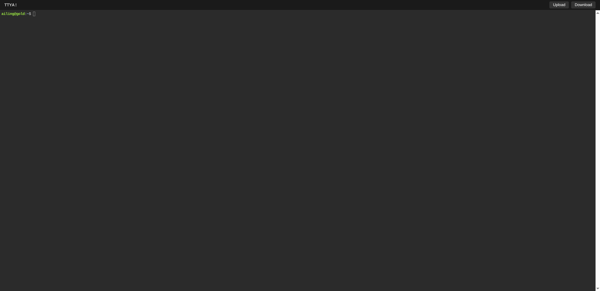

# ttya - Share your terminal over the web

ttya is a simple command-line tool for sharing terminal over the web, specialized with built-in file transfer and customizable UI.



# Features

- **Easy File Transfer**: Support uploading and downloading files directly through the web interface (requires `-W`).
- **Customizable Title**: Set your own window/tab title with the `--title` or `-L` option.
- **Modern Build Chain**: Built with Node.js 20+ and optimized for Safari and iOS browsers.
- **Performant Core**: Built on top of [libuv](https://libuv.org) and [WebGL2](https://developer.mozilla.org/en-US/docs/Web/API/WebGL_API) for speed.
- Fully-featured terminal with [CJK](https://en.wikipedia.org/wiki/CJK_characters) and IME support.
- [ZMODEM](https://en.wikipedia.org/wiki/ZMODEM) / [trzsz](https://trzsz.github.io) support.
- [Sixel](https://en.wikipedia.org/wiki/Sixel) image output support.
- SSL support via [OpenSSL](https://www.openssl.org) or [Mbed TLS](https://github.com/Mbed-TLS/mbedtls).
- Cross platform: Linux (musl), macOS, Windows (MingW).

# Installation

## Download Binaries
Download the pre-compiled binaries for your platform from the [Releases](https://github.com/AiLing2416/ttya/releases) page.

## Build from Source (Linux)
```bash
sudo apt-get update
sudo apt-get install -y build-essential cmake git libjson-c-dev libwebsockets-dev zlib1g-dev libuv1-dev
git clone https://github.com/AiLing2416/ttya.git
cd ttya && mkdir build && cd build
cmake ..
make && sudo make install
```

# Usage

## Command-line Options
```text
USAGE:
    ttya [options] <command> [<arguments...>]

OPTIONS:
    -p, --port              Port to listen (default: 7681, use `0` for random port)
    -i, --interface         Network interface to bind (eg: eth0), or UNIX domain socket path (eg: /var/run/ttya.sock)
    -c, --credential        Credential for basic authentication (format: username:password)
    -H, --auth-header       HTTP Header name for auth proxy
    -u, --uid               User id to run with
    -g, --gid               Group id to run with
    -s, --signal            Signal to send to the command when exit it (default: 1, SIGHUP)
    -w, --cwd               Working directory to be set for the child program
    -a, --url-arg           Allow client to send command line arguments in URL
    -W, --writable          Allow clients to write to the TTY (Required for File Transfer)
    -T, --terminal-type     Terminal type to report, default: xterm-256color
    -O, --check-origin      Do not allow websocket connection from different origin
    -m, --max-clients       Maximum clients to support (default: 0, no limit)
    -o, --once              Accept only one client and exit on disconnection
    -B, --browser           Open terminal with the default system browser
    -L, --title             Window title (default: ttya)
    -v, --version           Print the version and exit
    -h, --help              Print this text and exit
```

# Acknowledgments

This project is a fork of the excellent [ttyd](https://github.com/tsl0922/ttyd) by Shuanglei Tao. 
Special thanks to the following projects that made this possible:
- [xterm.js](https://xtermjs.org/) - Terminal front-end
- [libwebsockets](https://libwebsockets.org/) - WebSocket server
- [libuv](https://libuv.org/) - Cross-platform I/O
- [json-c](https://github.com/json-c/json-c) - JSON parsing

---

> ❤ Special thanks to [JetBrains](https://www.jetbrains.com/?from=ttyd) for sponsoring the opensource license to the original project.
